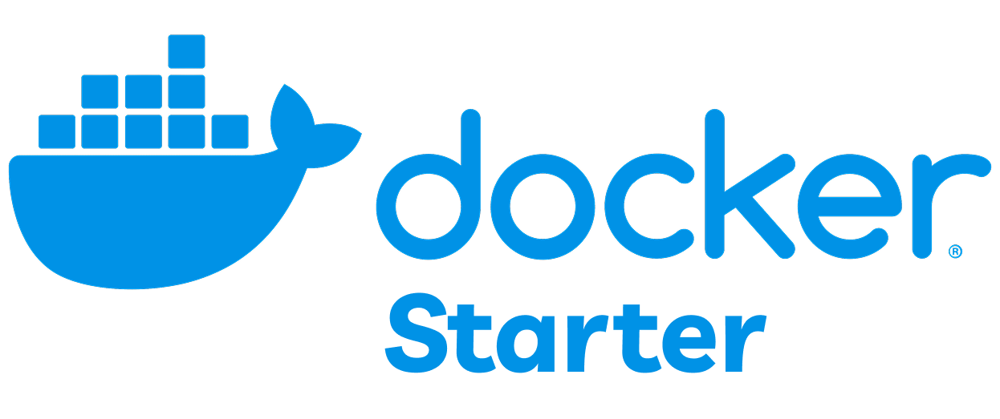

<div align="center">



### _Custom local domain + HTTP/2 + SSL_

[](https://www.docker.com/)
[](https://nginx.org/)
[](https://nodejs.org/)

</div>

# Docker Starter

**Ready-to-use starter for microservices architecture with Docker**

This project is a starter for creating web applications with microservices architecture, fully wrapped in Docker containers. Includes API server, frontend application and Nginx Gateway with SSL + HTTP/2 support.

## Architecture

The project consists of three main components:

#### API Service

- **Technology**: Single Node.js demo server
- **Port**: ${API_PORT}

#### Frontend Service

- **Technology**: Vanilla JavaScript + HTML + Nginx (demo app)
- **Port**: ${FRONT_PORT}
  - Static frontend with Nginx
  - Integration with API service
  - Automatic Docker build

#### Gateway Service

- **Technology**: Nginx
- **Ports**: 80 (HTTP), 443 (HTTPS)
- **Features**:
  - HTTP/2 support
  - Reverse proxy for API and Frontend
  - SSL/TLS termination
  - HTTP → HTTPS redirect
  - Security (HSTS, XSS Protection)

## 🚀 Quick Start

### Prerequisites

- Docker and Docker Compose
- Make
- mkcert (for SSL certificate generation)

### 1. Clone and Setup

```bash
git clone https://github.com/scott-walker/docker-starter.git
cd docker-starter
cp .env.example .env
```

### 2. Environment Variables Configuration

Edit the `.env` file:

```bash
# Main project settings
PROJECT_NAME=starter

# Gateway settings
GATEWAY_API_HOST=starter-api
GATEWAY_API_PORT=3000
GATEWAY_API_SERVER_NAME=api.host.lc
GATEWAY_FRONT_HOST=starter-front
GATEWAY_FRONT_PORT=3000
GATEWAY_FRONT_SERVER_NAME=host.lc

# API settings
API_PORT=3000

# Frontend settings
FRONT_PORT=3000
FRONT_API_HOST=api.host.lc
```

### 3. Generate SSL Certificates

```bash
make generate-ssl
```

### 4. Add Hosts to /etc/hosts

```bash
make add-hosts
```

### 5. Build and Run

```bash
# Build all images
make build

# Start all services
make start
```

## Available Commands

### Main Commands

| Command        | Description             |
| -------------- | ----------------------- |
| `make build`   | Build all Docker images |
| `make start`   | Start all services      |
| `make stop`    | Stop all services       |
| `make restart` | Restart all services    |

### Build Commands

| Command              | Description          |
| -------------------- | -------------------- |
| `make build-gateway` | Build Gateway image  |
| `make build-api`     | Build API image      |
| `make build-front`   | Build Frontend image |

### Run Commands

| Command            | Description            |
| ------------------ | ---------------------- |
| `make run-gateway` | Run Gateway container  |
| `make run-api`     | Run API container      |
| `make run-front`   | Run Frontend container |

### Utilities

| Command               | Description               |
| --------------------- | ------------------------- |
| `make generate-ssl`   | Generate SSL certificates |
| `make add-hosts`      | Add hosts to /etc/hosts   |
| `make create-network` | Create Docker network     |

## 🌐 Service Access

After startup, services will be available at the following addresses:

- **Frontend**: ${GATEWAY_FRONT_SERVER_NAME}
- **API**: ${GATEWAY_API_SERVER_NAME}

## Security

The project includes the following security measures:

- **SSL/TLS**: Automatic HTTP → HTTPS redirect
- **HSTS**: HTTP Strict Transport Security
- **XSS Protection**: Protection against cross-site scripting
- **Content Security**: Protection against MIME-type sniffing
- **Frame Options**: Protection against clickjacking

## License

This project is licensed under the MIT License - see the [LICENSE](LICENSE) file for details.

## 🆘 Support

If you have questions or issues: [Issue](https://github.com/scott-walker/docker-starter/issues)

<br/>

**Created with ❤️ for quick Docker project startup**
